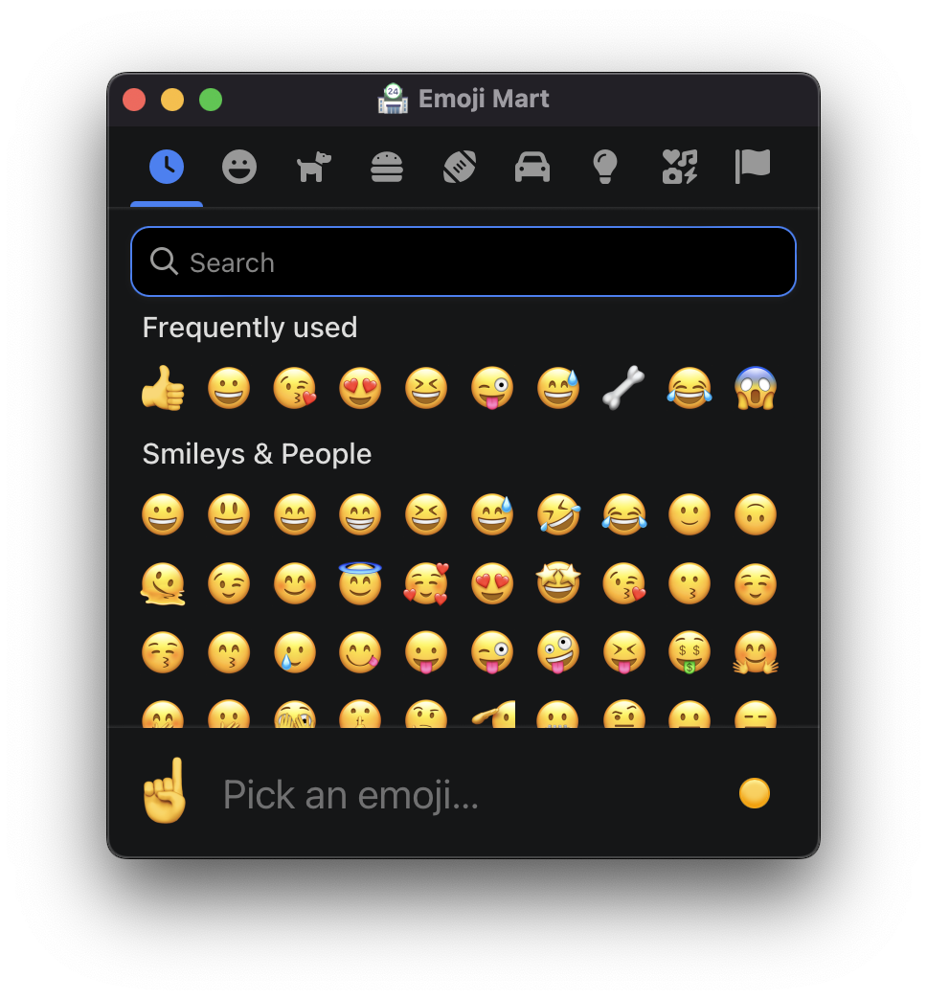

# 🏪 Emoji Mart Tauri

<p align="center">
  
</p>

[Emoji Mart](https://github.com/missive/emoji-mart) as a [tauri](https://tauri.app/) app, click on an emoji to copy it to the clipboard!

## Ideas

If you want a feature, please contribute, it's easy.

I could imagine the following features:

- press a modifier key to copy `:emoji_code:` instead of the emoji itself.
- settings to change appearance, basically the settings that are on the website of emoji mart: https://missiveapp.com/open/emoji-mart
- button to clear frequently used emojis
- design a nice icon, i'm not sure if we can use the `🏪` emoji image from apple (or from another emoji set) for this?
- feel free to open issues to discuss other features

## Why did I make this?

I needed something to try out [tauri](https://tauri.app/),
then I saw [@Darthagnon](https://github.com/Darthagnon)'s idea to package emoji mart as an desktop app: https://github.com/missive/emoji-mart/issues/787.

## Developing

```sh
# setup - install the dependencies
yarn
# dev - for developing and testing your changes
yarn tauri dev
# build - for production and create packages/installer
yarn tauri build
```

### Making a release

1. increase version in `package.json`
2. make a pr to push to the `release` branch

### Recommended IDE Setup

- [VS Code](https://code.visualstudio.com/) + [Tauri](https://marketplace.visualstudio.com/items?itemName=tauri-apps.tauri-vscode) + [rust-analyzer](https://marketplace.visualstudio.com/items?itemName=rust-lang.rust-analyzer)
